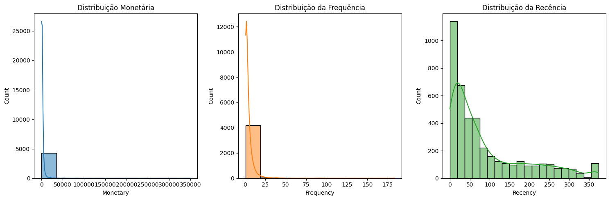
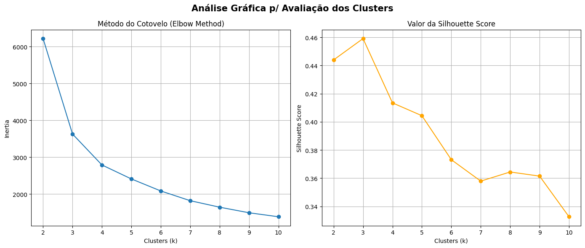
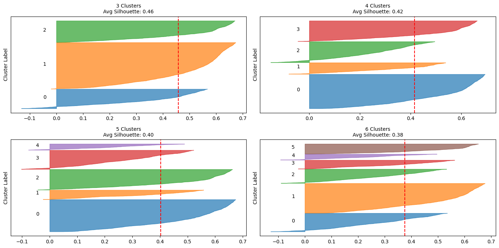
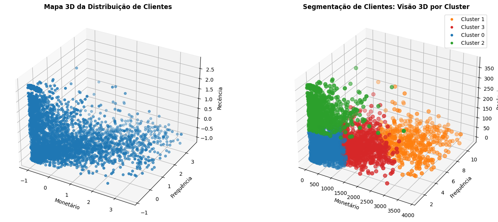
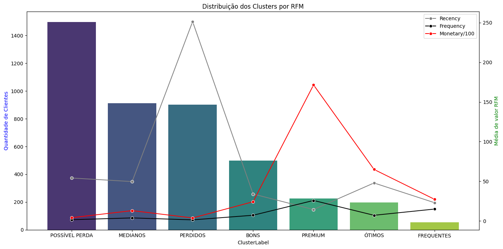

# Segmentação de Clientes utilizando Machine Learning

## Descrição do Problema

Uma loja de varejo online sediada no Reino Unido, visa compreender melhor as características de compra dos seus clientes. As transações ocorreram entre 01/12/2009 e 09/12/2011. A empresa vende principalmente artigos de presente exclusivos para todas as ocasiões. Muitos clientes da empresa são atacadistas.

Fonte dos Dados: https://archive.ics.uci.edu/dataset/502/online+retail+ii

## Objetivo do Projeto

O objetivo é segmentar os clientes em grupos com comportamentos de compras semelhantes. Com isso a empresa pode construir melhores conexões a fim de fidelizar seus clientes e recuperar clientes perdidos.

Link do Notebook: [customer-clustering](https://github.com/idfelipemalatesta/customers-segmentation/blob/main/notebooks/customers-clustering.ipynb)

## Solução

Vou utilizar o método **RFM** (Recência, Frequência e Valor Monetário) e **Aprendizado de Máquina Não Supervisionado** que desempenha um papel crucial, permitindo uma análise profunda e eficiente dos dados.

**1. Recência (R)** Refere-se ao tempo desde a última compra do cliente. Clientes que compraram recentemente têm maior probabilidade de comprar novamente. 
**2. Frequência (F)** Avalia quantas vezes um cliente comprou em um determinado período. Clientes frequentes são valiosos, pois tendem a ter maior lealdade. 
**3. Valor Monetário (M)** Refere-se ao total gasto por cada cliente em um determinado período. Clientes que gastam mais são geralmente mais valiosos para o negócio.

**Entregáveis:** 3 relatórios analíticos contendo:
1.	**Clientes agrupados por RFM**, organizados nos respectivos clusters/grupos.
2.	**Análise e interpretação** dos grupos, com sugestões de ações estratégicas.
3.	**Tabela com a média dos valores de RFM** para cada cluster identificado.

Tópicos do projeto:

- Análise Exploratória dos Dados
- Data Cleaning
- Feature Engineering (Recência, Frequência e Monetário)
- Identificação e Separação dos Outliers
- Pré-processamento (Standard Scale)
- Modelagem - KMeans Clustering
- Métricas Elbow Method e Silhouette Score para definir os clusters
- Análise dos Clusters, Análise dos Clientes Outliers
- Visualização dos Clusters p/ RFM e Conclusão

## Imagens do Projeto

Analisando a distribuição dos clientes por RFM:

Modelagem KMeans com Elbow Method e Silhouette Score:

Analisando os diagramas de Silhoutte para diversos clusters:

Distribuição dos Clientes por Clusters 3D Plot:

Visualização dos Clusters por RFM:

