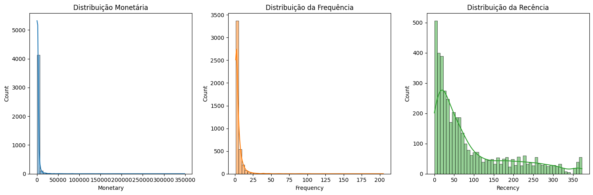
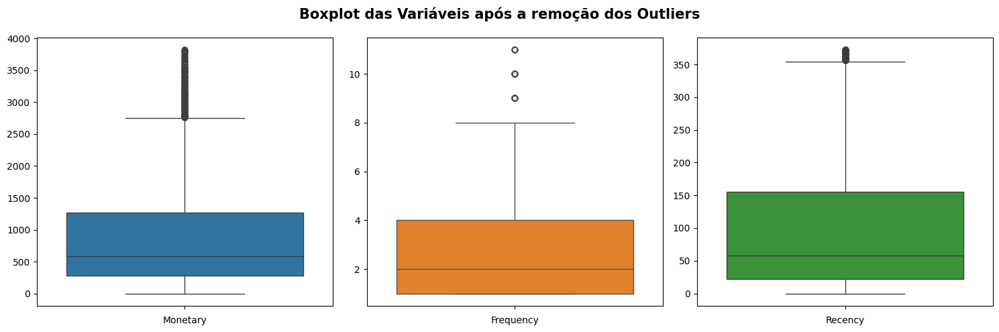
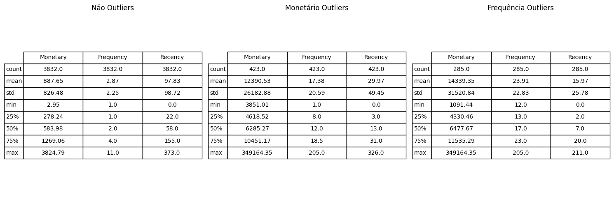
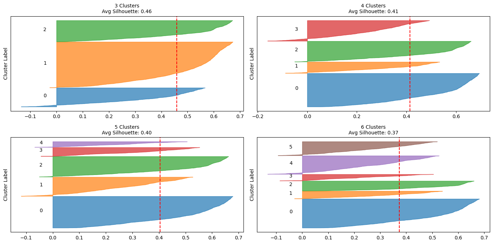
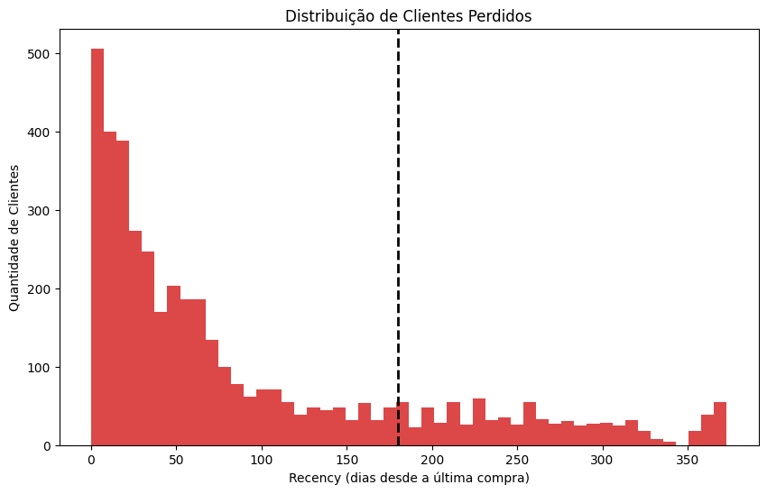

# Marketing Analytics - Segmentação de Clientes

## Descrição do Problema

Uma loja de varejo online sediada no Reino Unido, visa compreender melhor as características de compra dos seus clientes. As transações ocorreram entre 01/12/2009 e 09/12/2011. A empresa vende principalmente artigos de presente exclusivos para todas as ocasiões. Muitos clientes da empresa são atacadistas.

Fonte dos Dados: [UCI Machine Learning Repository](https://archive.ics.uci.edu/dataset/502/online+retail+ii)

## Objetivo do Projeto

O objetivo é segmentar os clientes em grupos com comportamentos de compras semelhantes. Com isso a empresa pode construir melhores conexões a fim de fidelizar seus clientes e recuperar clientes perdidos.
## Solução

- Segmentação de clientes por comportamento de compra utilizando o modelo RFM.
- Implementação do algoritmo de Machine Learning K-Means.
- Identificação de churn em clientes inativos há seis meses.

**Entregáveis: Três relatórios analíticos contendo:**
1.	Segmentação dos clientes por clusters, acompanhada de uma sugestão estratégica para engajamento.
2.	Distribuição e percentual de clientes em cada cluster.
3.	Lista de clientes inativos há 180 dias (indicadores de churn).

Link direto para o notebook: [Customer Segmentation](https://github.com/idfelipemalatesta/customers-segmentation/blob/main/notebooks/customers-clustering.ipynb)

## Documentação do Projeto

**Examinando a segmentação dos clientes com base na análise RFM:**

**Análise comparativa das estatísticas de clientes outliers e não outliers:**

**Análise dos diagramas de Silhouette:**

**Visualização final dos Clientes agrupados por seus clusters:**

